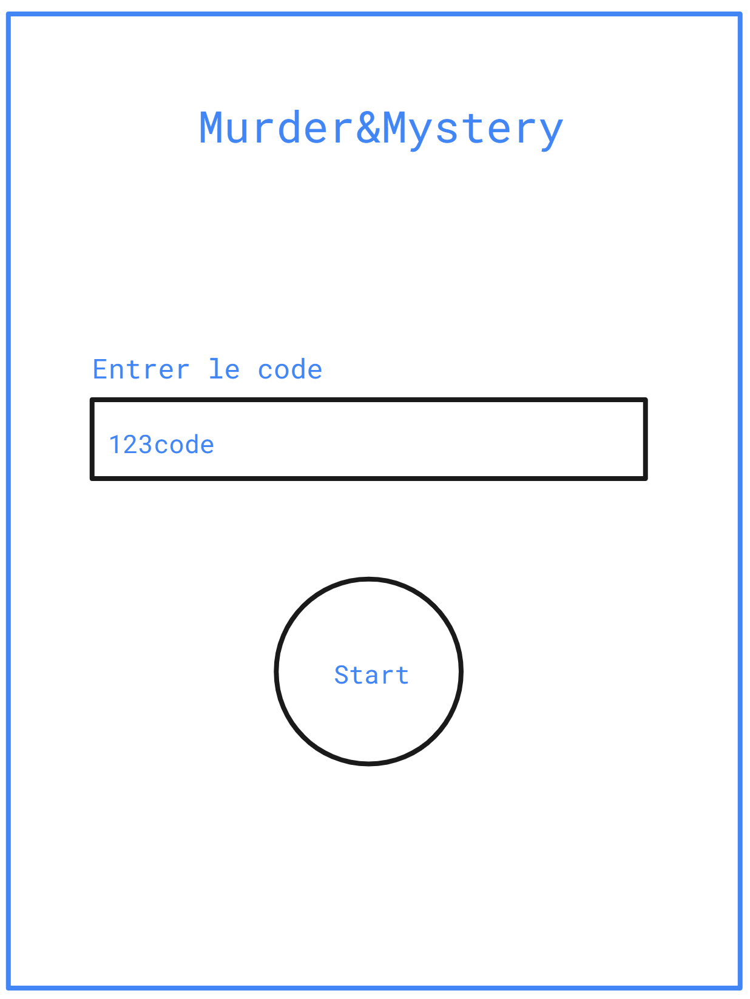
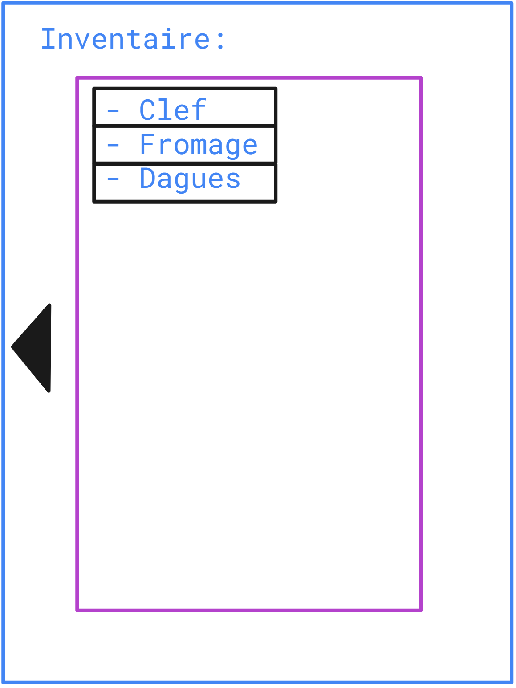
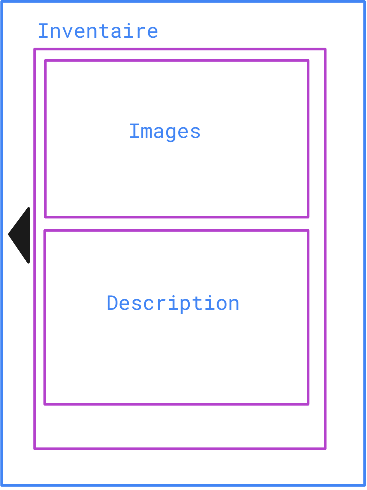
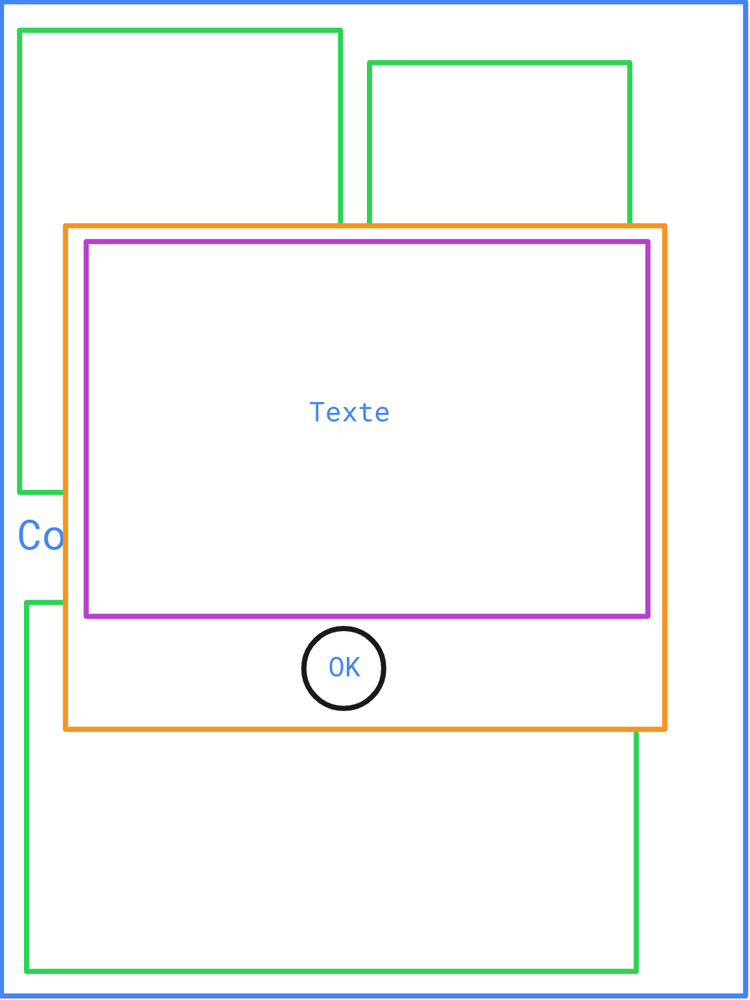
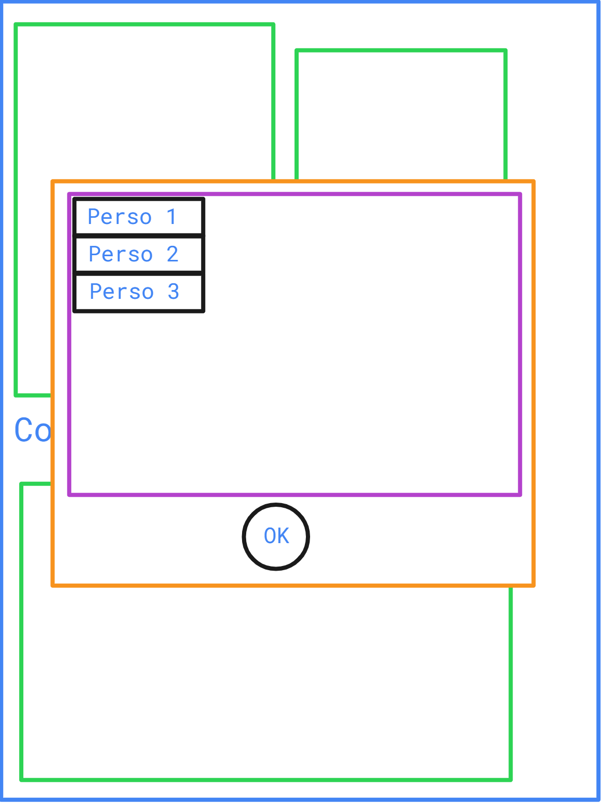

# Murder & Mystery Web-app

## Diverses informations

L'application doit être faites pour des smart-phones (responsivité). 

Admins peuvent :

* Gestion des des salles fictives 

  * Possibilité de lister les salles fictives disponibles

  * Possibilité de supprimer

  * Créer une salle
    * Admins fournissent une map
      * L'application génère un lien du type ``<www.domain.ch>/web-app/salle-fictive/<nom-de-la-salle-ou-identifiant>``
        * L'application fournit un QR-code au admins 
          * Utilitaire tiers ayant une API gratuit (Par exemple : https://goqr.me/api/)
            * Génération de QR-code a imprimer
* Gestion des compétences
  * Modifier les affichages des compétences
    * Message affiché à l'utilisateur
    * Affichage ou non à la cible
      * Message affiché à la cible

  * Modifier le temps de cooldown
  * Possibilité d'ajouté des compétences
    * Les compétences ajouté ne pourrait être que de type affichage
      * Pour de nouveaux comportements complexe (comme le vol/dépôt d'objet ou la téléportation) il me faudrait beaucoup de temps de R&D

    * Retirés les compétences ajoutés
      * Probablement bloqué la suppression des compétences demandant un comportement complexe

* Gestion des classes
  * Modifier les informations des classes
    * Lié des compétences aux classes
      * Retirer des compétences

  * Possibilité d'ajouter des classes
    * Retirer les classes ajoutés

* Gestion des fiches de personnages
  * Création d'une fiche
    * Image et description fournis par administrateur
      * Modifications des informations existante

    * Secrets fournis par l'administrateur
      * Modification des secrets existant

    * Les compétences sont représentés par des boutons.
      * Couleur, image de fond customisable
        * Modification par personnage

      * Les compétences font partie d'une liste finie

  * Lié des objets à une fiche de personnage (Object par défaut)
    * Retirer des objets

  * Lié une classe à un personnage
    * Retirer une classe

* Ajouter des objets
  * Admins fournissent une image et une description
  * Les objets peuvent être ramassé ou être un objet lut
  * Lié des objets à une salle fictives avec les coordonnées (x:y) de leur positions sur l'image
    * ​	UI réfléchie nécessaire
  * Modifier les objets existants
    * Retirer les objets existants
* Créer une partie
  * Importer une base de données pré-existante (partie créer précédément)
    * Ce processus est possible à tout moment cependant cela écraserait les données non sauvegardées
    * (Ne peut pas) importer une partie en cours (Est-ce nécessaire ?) (dans le sens ou l'état de la base de données ressemblerait à celle qui serait en fonction lors de la Murder)

  * Ajouté des personnages à la partie
    * La persistance des données des inventaires est générer à chaque ajout de personnage
  * Possibilité de "remettre à neuf" la base de données pour créer une nouvelle partie
    * Dans le cas ou il y aurait une autre configuration avec les mêmes classes et compétences

* Démarrer une partie
  * Au démarrage les inventaires des personnages sont vidés/ fournis avec leurs items par défaut
  * La connexion aux personnages est possible pour les utilisateurs.
* Arrêter de la partie
  * Les utilisateurs ne peuvent plus accéder à l'application avec leur code (suppression des cookies)
  * Les administrateurs peuvent redémarrer une partie
  * Sauvegarder la base de données des personnages avec leurs informations
    * Ce processus est possible à tout moment
    * (Ne peut pas) sauvegarder une partie en cours (Est-ce nécessaire ?)
    * Possibilité de sauvegarder l'état des inventaires si besoin

  * Message de fin?

Users peuvent :

* Se connecter à une partie démarrer avec un code de personnage
  * Code fournis par les administrateurs
  * Persistance dans le navigateur nécessaire (cookies)
    * Ils pourrait se reconnecter avec le code s'ils n'acceptent pas les cookies
* Utilisés les compétences liés à leur personnage
  * Un cooldown dynamique (affichage du timer sur le bouton / effet visuel) empêche le "spam" des compétences
  * Persistance pour que les utilisateurs n'appuie pas 2 fois sur le même personnage par erreur en cas de choix
* Accéder à des salles fictives par QR-code
  * Nouvelle fenêtre s'ouvre et affiche une carte avec des indices
    * Carte en SVG ? (Idéal pour zoomer sans perte de qualité)

    * Examiner des objets
      * Ramasser l'objet si possible

* Accéder à leur propre inventaire
  * 6 slots
  * Accéder aux informations des objets dans l'inventaire

* Recevoir des pop-ups (Pop-up modale ou nouvelle onglet)
  * En conséquence de compétence utiliser par l'utilisateur lui-même
    * Retour d'informations, choix de cible, 

  *  En conséquence d'une compétence d'un autre utilisateur
    * Information d'un malus, de l'usage d'une compétence (vol/dépôt)

## User part

> Note : Ceci n'est pas une représentation du design de l'application.

Violet --> Modulable, Dépendant des actions utilisateurs (Utilisateur presse sur bouton de son inventaire, ou presse sur un objet)

Noir --> Interactif par l'utilisateur (Boutons / liens / inputs)

Vert --> Arrière-plan (Lors d'un clique sur l'arrière plan : Annulation de l'action dans le cas de la sélection d'un personnage par exemple ou retour au dit-arrière plan pour les message informatif)

Orange --> Premier-plan (pop-ups, possibilité de bloqué le retour à l'arrière plan tant que l'utilisateur de clique pas sur le bouton désigné)

Commence avec un login ou l'utilisateur entre un code fournis par les administrateurs

Montre les informations sur le personnages (Nom, classe, compétences) 

Les fiches de personnages sont générer par les administrateur (C.F [Admin part](#Admin part) ) avec customisation des zones modulables. 

Les utilisateurs peuvent ouvrir leur inventaire en appuyant sur la flèche.

A l'appuie de l'un des objets, une fenêtre d'informations sur le dit-objet s'ouvre

Les utilisateurs peuvent aussi recevoir des pop-up affichant un texte décrivant les effet d'une compétences ou un simple message informatif après usage d'une compétence ainsi qu'un bouton pour fermer la fenêtre

Dans le cas ou l'utilisateur doit choisir un autre personnage pour une compétence, une autre pop-up apparaît avec une liste (scrollable) des personnages sélectionnable de la partie ainsi qu'un bouton pour confirmer la sélection

## Admin part
