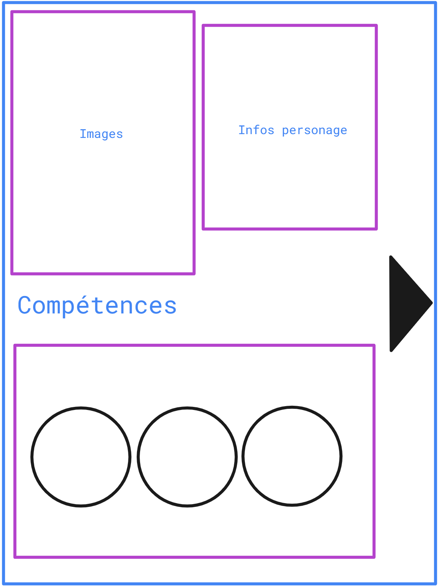

# Murder & Mystery Web-app

## Diverses informations

L'application doit être faites pour des smart-phones (responsivité). 

Admins peuvent :

* Gestion des des salles fictives 

  * Possibilité de lister les salles fictives disponibles

  * Possibilité de supprimer

  * Créer une salle
    * Admins fournissent une map
      * L'application génère un lien du type ``<www.domain.ch>/web-app/salle-fictive/<nom-de-la-salle-ou-identifiant>``
        * L'application fournit un QR-code au admins 
          * Utilitaire tiers ayant une API gratuit (Par exemple : https://goqr.me/api/)
            * Génération de QR-code a imprimer
* Gestion des compétences
  * Modifier les affichages des compétences
    * Message affiché à l'utilisateur
    * Affichage ou non à la cible
      * Message affiché à la cible

  * Modifier le temps de cooldown

* Gestion des classes
  * Modifier les informations des classes
    * Lié des compétences aux classes
    * 

* Gestion des fiches de personnages
  * Création
    * Image et description fournis par administrateur
    * Secrets fournis par l'administrateur
    * Les compétences sont représentés par des boutons.
      * Couleur, image de fond customisable
      * Les compétences font partie d'une liste finie

  * Lié des objets à une fiche de personnage (Object par défaut)
  * Lié une classe à un personnage

* Ajouter des objets
  * Admins fournissent une image et une description
  * Lié des objets à une salle fictives avec les coordonnées (x:y) de leur positions sur l'image
    * ​	UI réfléchie nécessaire
* Créer une partie
  * Ajouté des personnages à la partie (potentiel de pas avoir tous les personnages utilisé?)
    * La persistance des données des inventaires est générer à chaque ajout de personnage
* Démarrer une partie
  * Au démarrage les inventaires des personnages sont vidés/ fournis avec leurs items par défaut
  * La connexion aux personnages est possible pour les utilisateurs.

Users peuvent :

* Se connecter à une partie avec un code de personnage
  * Code fournis par les administrateurs
  * Persistance dans le navigateur nécessaire (cookies)
    * Ils pourrait se reconnecter avec le code s'ils n'acceptent pas les cookies
* Utilisés les compétences liés à leur personnage
  * Un cooldown dynamique (affichage du timer sur le bouton / effet visuel)
* Ramasser des objets
  * Par le biais de QR-code?

## User part

> Note : Ceci n'est pas une représentation du design de l'application.

Violet --> Modulable, Dépendant des actions utilisateurs (Utilisateur presse sur bouton de son inventaire, ou presse sur un objet)

Noir --> Interactif par l'utilisateur (Boutons / liens / inputs)

Commence avec un login ou l'utilisateur entre un code fournis par les administrateurs

Montre les informations sur le personnages (Nom, classe, compétences) 

Les fiches de personnages sont générer par les administrateur (C.F [Admin part](#Admin part) ) avec customisation des zones modulables. 

Les utilisateurs peuvent ouvrir leur inventaire en appuyant sur la flèche.

A l'appuie de l'un des objets, une fenêtre d'informations sur le dit-objet s'ouvre

## Admin part
