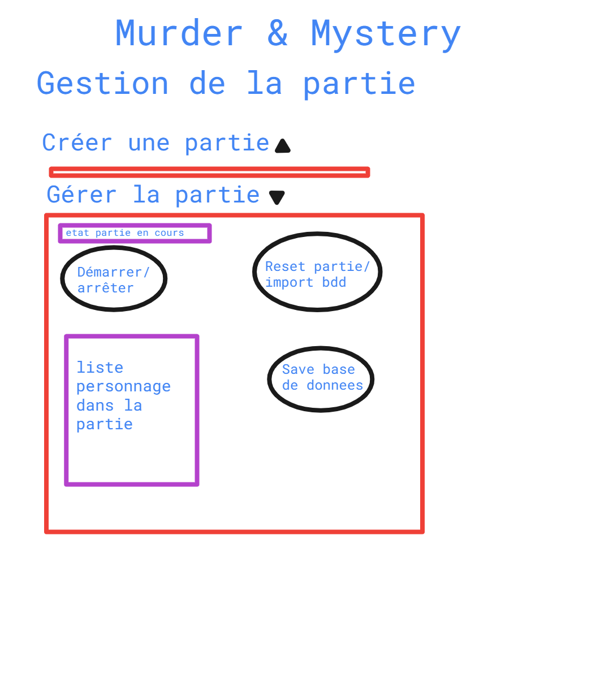
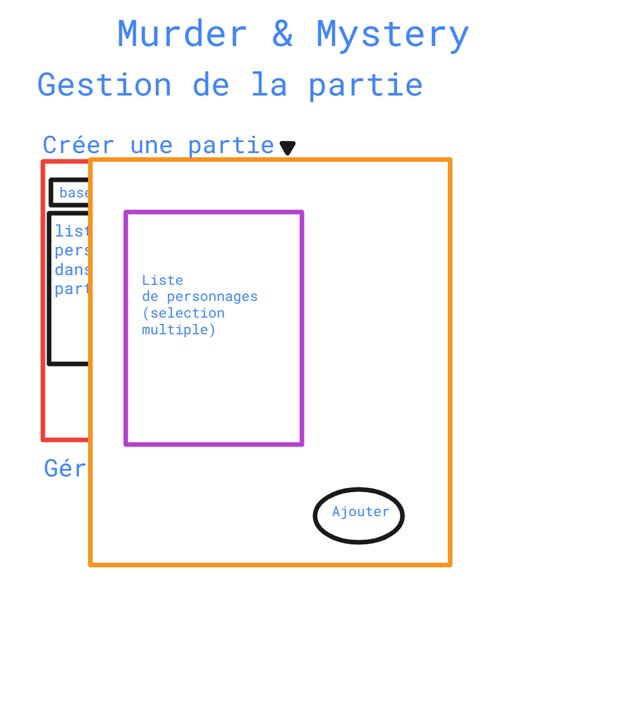

## Analyse

L'application doit être faites pour des smart-phones (responsivité). 

Admins peuvent :

* Gestion des des salles fictives 

  * Possibilité de lister les salles fictives disponibles

  * Possibilité de supprimer

  * Créer une salle
    * Admins fournissent une map
      * L'application génère un lien du type ``<www.domain.ch>/web-app/salle-fictive/<nom-de-la-salle-ou-identifiant>``.html
        * L'application fournit un QR-code au admins 
          * Utilitaire tiers ayant une API gratuit (Par exemple : https://goqr.me/api/)
            * Génération de QR-code a imprimer
* Gestion des compétences
  * Modifier les affichages des compétences
    * Message affiché à l'utilisateur
    * Affichage ou non à la cible
      * Message affiché à la cible

  * Modifier le temps de cooldown
  * Possibilité d'ajouté des compétences
    * Les compétences ajouté ne pourrait être que de type affichage
      * Pour de nouveaux comportements complexe (comme le vol/dépôt d'objet ou la téléportation) il me faudrait beaucoup de temps de R&D

    * Retirés les compétences ajoutés
      * Probablement bloqué la suppression des compétences demandant un comportement complexe

* Gestion des classes
  * Modifier les informations des classes
    * Lié des compétences aux classes
      * Retirer des compétences

  * Possibilité d'ajouter des classes
    * Retirer les classes ajoutés

* Gestion des fiches de personnages
  * Création d'une fiche
    * Image et description fournis par administrateur
      * Modifications des informations existante

    * Secrets fournis par l'administrateur
      * Modification des secrets existant

    * Les compétences sont représentés par des boutons.
      * Couleur, image de fond customisable
        * Modification par personnage

      * Les compétences font partie d'une liste finie

  * Lié des objets à une fiche de personnage (Object par défaut)
    * Retirer des objets

  * Lié une classe à un personnage
    * Retirer une classe

* Ajouter des objets
  * Admins fournissent une image et une description
  * Les objets peuvent être ramassé ou être un objet lut
  * Lié des objets à une salle fictives avec les coordonnées (x:y) de leur positions sur l'image
    * ​	UI réfléchie nécessaire
  * Modifier les objets existants
    * Retirer les objets existants
* Créer une partie
  * Créer une nouvelle partie lors-ce qu'il y en a déjà une existante l'écraserait
    * Un message de prévention sera affichés

  * Importer une base de données pré-existante (partie créer précédément)
    * Ce processus est possible cependant cela écraserait les données non sauvegardées

  * Ajouté des personnages à la partie

* Démarrer une partie
  * Au démarrage les inventaires des personnages sont vidés/ fournis avec leurs items par défaut
  * La connexion aux personnages est possible pour les utilisateurs.
* Arrêter de la partie
  * La partie peut être redémarré
    * Ceci afin de bloqué les connexions des joueurs pour résoudre une éventuelle erreur dans les données de l'applications (nom de compétences ou personnage mal renseigné, etc) ou simplement si la partie est démarré trop tôt

  * Les utilisateurs ne peuvent plus accéder à l'application avec leur code (suppression des cookies)
  * Possibilité de "remettre à neuf" la base de données pour créer une nouvelle partie
    * Pour recommencer une nouvelle partie avec les données de départ.
    * Ou "vider" la base de données pour créer une nouvelle configuration. (hormis les compétences "hard-codé" (ayant un comportement avancé) comme vol à la tir)
  * Sauvegarder la base de données des personnages avec leurs informations
    * Ce processus est possible quand une partie est arrêté
    * Possibilité de sauvegarder l'état des inventaires si besoin

  * Message de fin?

Users peuvent :

* Se connecter à une partie démarrer avec un code de personnage
  * Code fournis par les administrateurs
  * Persistance dans le navigateur nécessaire (cookies)
    * Ils pourrait se reconnecter avec le code s'ils n'acceptent pas les cookies
* Utilisés les compétences liés à leur personnage
  * Un cooldown dynamique (affichage du timer sur le bouton / effet visuel) empêche le "spam" des compétences
  * Persistance pour que les utilisateurs n'appuie pas 2 fois sur le même personnage par erreur en cas de choix
* Accéder à des salles fictives par QR-code
  * Nouvelle fenêtre s'ouvre et affiche une carte avec des indices
    * Carte en SVG ? (Idéal pour zoomer sans perte de qualité)

    * Examiner des objets
      * Ramasser l'objet si possible

* Accéder à leur propre inventaire
  * 6 slots
  * Accéder aux informations des objets dans l'inventaire

* Recevoir des pop-ups (Pop-up modale ou nouvelle onglet)
  * En conséquence de compétence utiliser par l'utilisateur lui-même
    * Retour d'informations, choix de cible, 

  *  En conséquence d'une compétence d'un autre utilisateur
    * Information d'un malus, de l'usage d'une compétence (vol/dépôt)

## User part

> Note : Ceci n'est pas une représentation du design de l'application.

**Violet** --> Modulable, Dépendant des actions utilisateurs (Utilisateur presse sur bouton de son inventaire, ou presse sur un objet)

**Noir** --> Interactif par l'utilisateur (Boutons / liens / inputs)

**Vert** --> Arrière-plan (Lors d'un clique sur l'arrière plan : Annulation de l'action dans le cas de la sélection d'un personnage par exemple ou retour au dit-arrière plan pour les message informatif / peut signifié la page précédente)

**Orange** --> Premier-plan (pop-ups, possibilité de bloqué le retour à l'arrière plan tant que l'utilisateur de clique pas sur le bouton désigné / peut aussi désigné une nouvelle fenêtre)

**Rouge** --> Drop-down (formulaire ou bloque qui se déroule)

Commence avec un login ou l'utilisateur entre un code fournis par les administrateurs

Ils se connectent avec une url de type `<www.domain.ch>/web-app/game/login.html`

Montre les informations sur le personnages (Nom, classe, compétences) 

Avec une url de type `<www.domain.ch>/web-app/game/character/<code de connexion ou identifiant unique>.html`

Les fiches de personnages sont générer par les administrateur avec customisation des zones modulables. 

Les utilisateurs peuvent ouvrir leur inventaire en appuyant sur la flèche.

A l'appuie de l'un des objets, une fenêtre d'informations sur le dit-objet s'ouvre

Les utilisateurs peuvent aussi recevoir des pop-up affichant un texte décrivant les effet d'une compétences ou un simple message informatif après usage d'une compétence ainsi qu'un bouton pour fermer la fenêtre

Dans le cas ou l'utilisateur doit choisir un autre personnage pour une compétence, une autre pop-up apparaît avec une liste (scrollable) des personnages sélectionnable de la partie ainsi qu'un bouton pour confirmer la sélection

## Admin part

Les administrateurs gèrent les données ainsi que certains aspect physique de l'application

Ils se connectent en accédant à une url de type `<www.domain.ch>/web-app/admins/login.html`

Suite à quoi ils sont présenté avec un menu principale faisant lien avec les différent écrans de gestions

#### Gestion salles fictives

Le menu de gestion des salles fictives contient une liste des salles existante ainsi qu'un menu pour ajouter une nouvelle salle, qui une fois ajouté s'ajoute à la liste ou l'admin peut la manager. Ces deux composants sont dans une "dropdown" ou fenêtre déroulante.

Cette liste est constitué de liens/boutons redirigeant sur le détail de la salle contenant un QR-code permettant au joueur d'ouvrir la salle (imprimable), un menu pour lié des objets à la salle, ainsi que des boutons pour supprimer/modifier la salle en question.

Le menu d'ajout d'objet permet de cliquer sur l'image avec un affichage de la position de la souris (ou dernier appuie si manager sur téléphone) et de sélectionner un objet dans une liste existante. L'ajout n'est  pas fait si aucune position n'est entrée ou si aucun objet n'est sélectionné

#### Gestion des objets

La gestion des objets est plus ou moins similaire, à l'exception qu'il n'y a pas de liaison avec une autre entité (salle fictive ou autre) ici

Détail d'un objet similaire au salles fictives avec possibilité de suppression (suppression bloqué si l'objet est présent sur une salle / ou si on choisi de ne pas bloqué cela supprimerais l'objets de toute les salles qui le contient) ou modification

#### Gestion compétences

Gestion des compétences similaire avec possibilité de sélectionner un cooldown (en secondes), de choisir si une compétence cible un autre personnage (montre une liste de personnage au joueur) ainsi que 2 messages différents de retour (si nécessaire) pour l'utilisateur et sa cible (s'il y a une cible)

Possibilité de supprimer et modifier les compétences.

Les compétences ayant un comportement complexe comme dépôt d'objet ne sont pas supprimable.

#### Gestion classes

La description n'est pas présente sur ton exemple, mais ça peut être retirer / gardé pour les admins seulement

Détail d'une classe similaire au reste, excepté l'ajout de compétence qui ouvre une pop-up ou nouvelle fenêtre avec une liste de compétences multi-sélectionnable.

#### Gestion personnages

Création des personnages en fournissant un code de connexion qui est modifiable dans les détails du personnage, ainsi qu'une sélection de la classe du personnage.

Le détail d'un personnage montre les objets par défaut, un préview des compétences de la classe associé (vue comme l'utilisateur).

Possibilité de supprimer et modifier. La modification peut inclure une personnalisation des couleurs des compétences par personnage si nécessaire.

#### Gestion de la partie
Les administrateur créer une partie en ajoutant des personnages dans la liste (la liste sert pour le ciblage des compétences principalement), avec possibilité d'importer directement une base de données (fichier xml ou autre à convenir). Ceci dans le cas de changement de domaine, perte de données dans la base existante, etc.

La gestion permet de démarrer une partie existante (besoin de créer une partie en premier) permettant l'accès au jouer ainsi que de l'arrêter pour bloquer l'accès ou éditer des informations de l'application. 

Exemple des pop-up / fenêtre de sélection pour lié des entitées (dans ce cas des personnages à une partie).

#### Gestion de la base de données

La gestion de la base de données sera la zone ou tous les aspects technique sont gérer, importer une base de données,

exporter (similaire aux boutons dans la gestion de la partie avec plus de fonctionnalités) ainsi que la possibilité de changer le code de connexion des administrateurs.

## Maquette

#### MCD

#### MLD

#### DC

#### DC et classe

#### Persistance

##### DemoData

##### Mémoire

##### Base de données

